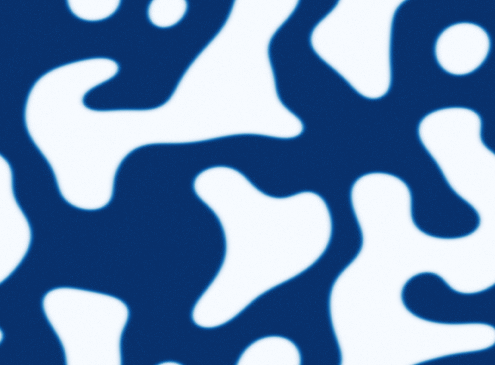

# Optimal Nano-structure design at crystal surfaces

# Intro slide
Systems with which we're working / we will work on
- **Internship**: 2D Ising model, monolayer deposition (2D lattice in contact with a gas).
- **PhD project**: More general nanostructures, like cristal surface with atomic steps.

# Phase separation
[?] The dynamics of the systems we're working on during the internship _can be described as_ a phase separation.

This phenomena occurs in many different systems, for example

### Polymer solution
Here we can see an homgeneous solution with an high concentration of a polymer.

Quenching at a lower temperature we see the rising of the high and poor concentrated phases.
As time goes on, we see better a distinction between the rich (the black) and poor polymer phases.

[Backscatter Electron microscope. (a) Initial / (b) Quenched at 90C for 30s / (c) Quenched at 90C for 60s. Black is the polymer concentrated phase]

### Colloids
Here we see a solution of colloids in a $\mu$-channel, that goes under a phase-separation process. Here the white phase has less concentration of colloids.

[Confocal laser scanning microscopy (CLSM) images of an inner layer (bulk) of the channel. The channel confinement is in the gravity direction of 18 $\mu m$. The colloids R=110nm. White phase has 1kg/m3 less colloids than the black.]

### Binary alloy
Here instead we have a binary alloy CoCrCu just after casting, here the two phases differ on the concentration of the two components.
As casting is slow, you can see there are domains of one phase trapped in the other.

[Trasmission electron microscope. As-cast (fast cooled) CoCrCu binary alloy. The black phase is the CoCr rich one]

# Spinoidal decomposition

We focus on a particular kind of phase separation: the spinoidal decomposition.
In particular we focus on the case when the amount of each phase is not conserved in time.

This phenomena happens in the Ising model when it is quenched under the critical temperature.

And as a "**monolayer deposition process**" is equivalent to the 2D Ising model, we can see the domain shapes are similar in this case.

[Au thin film, black spots indicate holes in the first layer. The surface touches an acqueos solution of Au atoms and an acid KCl. Applying a strong potential difference between the surface and the STM tip, atoms are electrochemically detached from the first layer, way faster than the surface diffusion rate.]

# A continuos theory (TDGL)
We have a **simple continuos** model to describe this kind of phase separation.
It is possible to give a **continuos** description by defining a **scalar order parameter** as the **local** magnetization.

Then the dynamics of the order parameter, close to the critical temperature is

$$\partial u = \Delta u + Cu - u^3$$

where C is a parameter that we can control by changing the Temperature $C\propto (T_c-T)$.

By going from positive to negative value of C, the disordered phase goes from stable to unstable, so we have spinoidal decomposition.

### Universality
This equation is called time-dependent Gitzburg-Landau equation, because it cames from the Landau-Gitzburg theory.
As that theory is accurate close to the critical point, then this equation **must hold for all systems** that resemble the simmetries of the Ising model, as soon as the temperature is close to the critical point.

# Goal

So the question that motivates our work is: can we control the properties of the domains (shape, size, density) by only changing the temperature over time close to the critical value?

# Modulating the temperature

In order to understand what properties of the domains we can control, we need to understand how the dynamics of the boundaries is affected by changes of temperature over time.

### Motion by curvature

The mechanism governing the dynamics of interfaces **at fixed temperature** is motion by curvature.

Each point of an interface moves with a normal velocity proportional to the local curvature $\kappa$.

$$v = -\kappa$$

### Tools
To check if this behaviour is affected by changes in temperature over time, we **developed** both analytical and numerical tools:
- **Analytical tool**: Multi-scale expansions that enable to study the system response in the limits of fast and slow changing temperature. 
- **Numerical tool**: We implemented an existing code for simulations. We realized it used to fail in simulating some features of the dynamics. So we made a study for selecting the right integration algorithm and we adopted Crank-Nicholson in Fourier space. 

We considered a simple initial state, where the curvature is constant all over the boundary.

There we checked **quantitatively** motion by curvature in the simulations. Both for fixed temperature and slow and fast oscillating temperature.

But **we found that we cannot do much!** In fact both simulations and our analytical expansions agree that the dynamics of the interfaces is not affected by changing temperature over time!

# Backup slides

