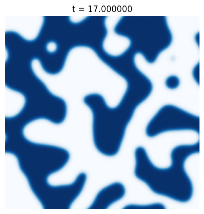

The division is (total 8 min)
- 4 min for internship work
- 4 min for phd project

# Internship

Start by showing some physical systems.

## Ising model
- The Ising model is a very important model in statistical mechanics, because of **...**
- If we quench the system under the critical temperature, we have rising of magnetic domains that grow or shrink, until there is only one big domain (say something ese?).

## A continuos description
- If we define a local magnetization $m$ (more explicit?), the dynamics  _near the critical temperature_ **is described** by the TDGL equation
$$\partial m = \Delta m + C(t)m - m^3$$
$$C \propto (T-T_c)$$
(Should I find the right coefficient for C in the ising model? E.g. To understand quantitatively T-Tc when C=1)

- **But** this equation is **way more** general, in fact describes very different systems, like

## Lattice-Gas model
A growth process on a 2D surface when it is dominated by the attachment/detachment mechanism (more explicit?).
[show Graphene pictures]

## Reaction-Diffusion process (no images to show)
If $m$ is the concentration of a **single specie** of particles, then this equation describes
- their diffusion $\delta m$
- the change in concentration due to *particular reactions** between the particles, described by the additional term (more explicit about the reaction that occur?)

---------------------------
## Goal of the internship
[Show picture again 2D simulation]

The question of our internship is wheter we can control the **shapes** of this domains **by only** changing the Temperature near the critical value. So can we control the dynamics by loosing only the **time traslational** simmetry? (say about simmetry or no?)?

We discovered that **we cannot do much** as the principal features of the dynamics do not change.

## Motion by curvature
In fact the main feature of the dynamics **at costant temperature**, is that the interfaces between domains move with a velocity proportional to the local curvature.
[2D simulation with **arrows**]

## Results
And what we found is that this motion is not affected by oscillating the temperature in time:
[plot of R^2 vs t]

We saw this both with:
- Simulations: we had already a code (say that or only x questions?), but it turns out it didn't integrate correctly the dynamics. So we changed the integration algorithm [now we use Crank-Nicholson in Fourier space].
- Multiscale expansions: We analitically studied the dynamics in the limits when the temperature oscillates fast or slow in time.

    
        where do I talk about simmetries? 